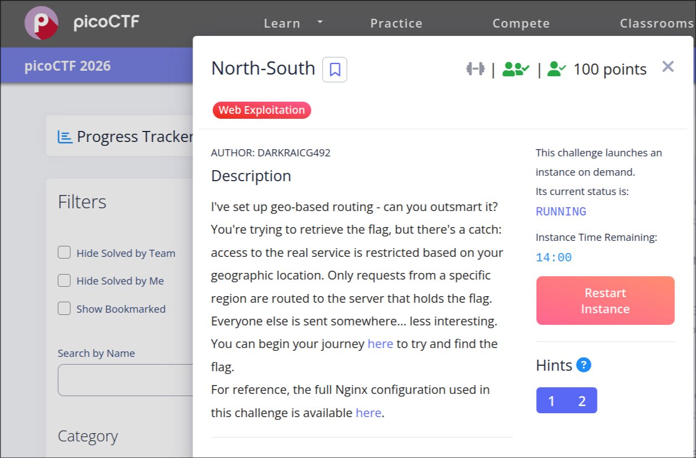
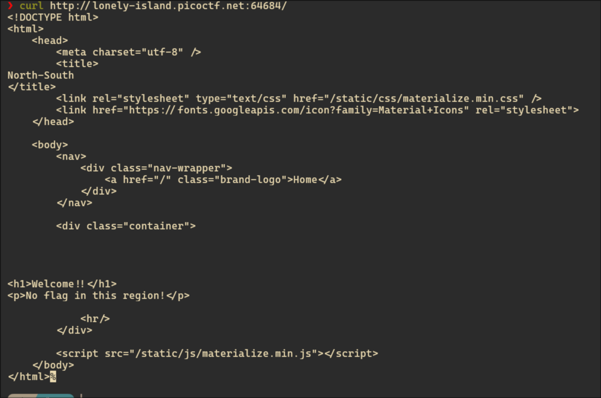
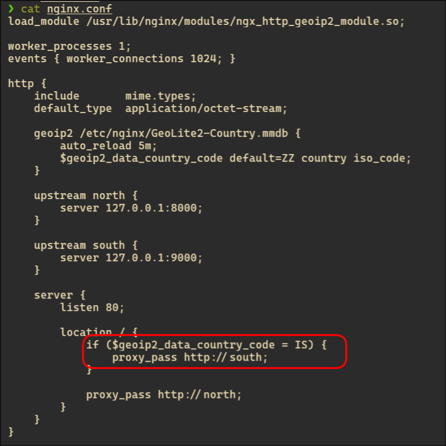
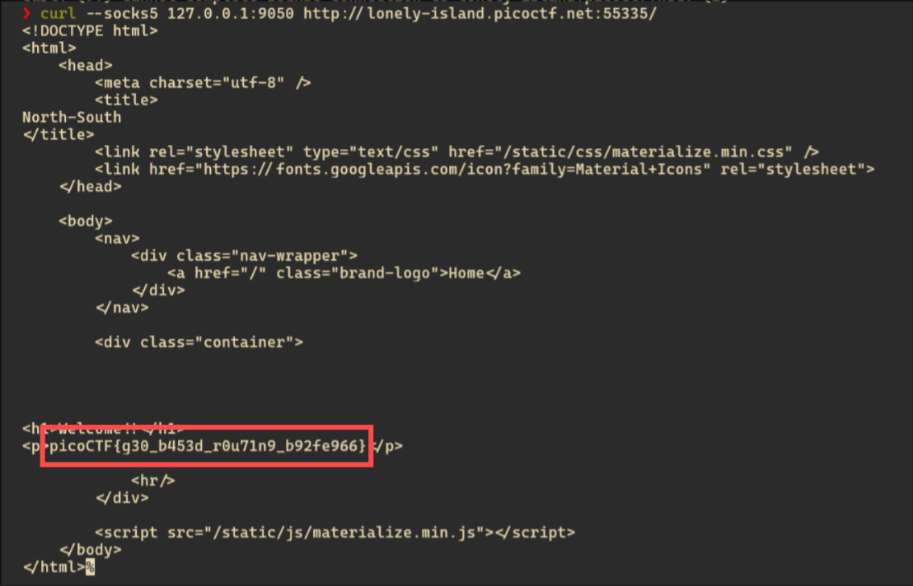

# picoCTF 2026 – North-South

## 📌 Challenge Overview

- **Name:** North-South
- **Category:** Web Exploitation
- **Difficulty:** Easy–Medium
- **CTF:** picoCTF 2026
- **Concepts:** GeoIP Filtering, Reverse Proxy, Access Control Bypass

---

## 🧩 Challenge Description

The challenge implements **geo-based routing**, where only users from a specific country can access the backend service containing the flag.

All other users are redirected to a decoy server.



---

## 🎯 Objective

Bypass the geo-restriction mechanism and retrieve the flag from the restricted backend.

---

# 🔍 Phase 1 — Initial Reconnaissance

I started by accessing the application:

```
curl http://lonely-island.picoctf.net:64684/
```

### 🔎 Response:

```
Welcome!!
No flag in this region!
```

---



---

## 🧠 Analysis

- The application restricts access based on **geographic location**
- My current IP is not allowed
- The flag is hosted on a **different backend service**

---

# ⚙️ Phase 2 — Source Code Analysis (Critical Step)

The provided `nginx.conf` reveals the routing logic:

```
geoip2 /etc/nginx/GeoLite2-Country.mmdb {
    $geoip2_data_country_code default=ZZ country iso_code;
}

location / {
    if ($geoip2_data_country_code = IS) {
        proxy_pass http://south;
    }

    proxy_pass http://north;
}
```

---



---

## 🧠 Key Insight

| Condition | Routing |
| --- | --- |
| Country = IS (Iceland 🇮🇸) | south (flag server) |
| Others | north (decoy server) |

---

## 🎯 Attack Surface

- GeoIP-based access control
- Reverse proxy routing
- IP-based trust model

---

# ❌ Phase 3 — Failed Attempt: Header Spoofing

I attempted to spoof my IP using headers:

```
curl-H"X-Forwarded-For: 82.221.129.208" http://lonely-island.picoctf.net:64684/
```

### ❌ Result:

```
No flag in this region!
```

---


---

## 🧠 Why This Failed

- The server uses **GeoIP module at network level**
- It checks **real client IP (TCP connection)**
- It **does NOT trust HTTP headers**

👉 So:

```
X-Forwarded-For = useless ❌
```

---

# 🚀 Phase 4 — Strategy Shift

At this point, I changed my approach:

> If I cannot fake the IP… I must actually **change my origin IP**
> 

---

# 🧅 Phase 5 — Using Tor (Initial Attempt)

I started Tor:

```
sudo systemctlstart tor
```

Then routed traffic via Tor:

```
curl--socks5127.0.0.1:9050 http://lonely-island.picoctf.net:64684/
```

---

### ❌ Result:

Still no flag.


## 🧠 Insight

- Tor uses **random exit nodes**
- My traffic may not originate from Iceland

---

# 🔧 Phase 6 — Forcing Iceland Exit Node

To control the exit node, I modified Tor config:

```
sudo nano /etc/tor/torrc
```

Added:

```
ExitNodes {is}
StrictNodes 1
```

---


---

Restart Tor:

```
sudo systemctlrestart tor
```

---

# 🎯 Phase 7 — Final Exploitation

```
curl--socks5127.0.0.1:9050 http://lonely-island.picoctf.net:55335/
```

---

### 🎉 Response:

```
picoCTF{g30_b453d_r0u71n9_b92fe966}
```

---



---

# 🏁 Flag

```
picoCTF{g30_b453d_r0u71n9_b92fe966}
```

---

# 📊 Attack Flow

```
[Your Machine]
      ↓
[Tor Client]
      ↓
[Iceland Exit Node 🇮🇸]
      ↓
[GeoIP Check = IS ✅]
      ↓
[South Server → FLAG]
```

---

# 🔥 Root Cause Analysis

## ❌ What Went Wrong

- Reliance on **IP-based geolocation**
- No authentication layer
- Trusting user location blindly
- Backend exposed via routing logic

---

## ✅ Secure Fixes

- Implement authentication (JWT / sessions)
- Avoid relying only on GeoIP
- Use Zero Trust architecture
- Validate user identity, not IP

---

# 📚 Key Takeaways

- GeoIP-based restrictions are **easily bypassed**
- Real-world bypass methods:
    - Tor
    - VPN
    - Proxy chaining
- Always analyze backend configs (like nginx)

---

# 🔗 Connect

- GitHub: [https://github.com/Ajans-45](https://github.com/Ajans-45)
- LinkedIn: http://www.linkedin.com/in/ajans-s/

---
